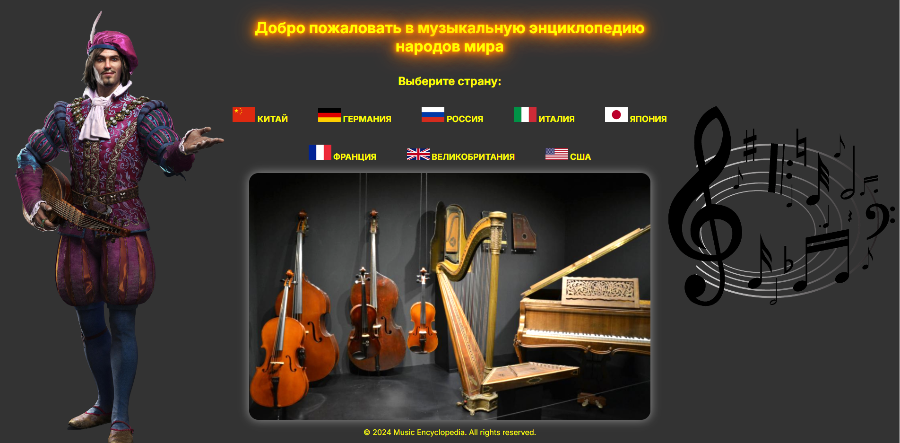

# MusicalEncyclopedia

This project was developed as part of a learning process to study and explore Django, a high-level Python web framework. The goal was to gain practical experience in building web applications, understanding Django's core features, and implementing a functional, user-friendly interface.

## Technologies

- **Python**
- **Django**
- **SQLite**
- **HTML/CSS/JavaScript**

## Use of Third-Party Materials
> [!WARNING]
This project includes textual and graphic materials from Wikipedia. These materials are licensed under the [Creative Commons Attribution-Share-Alike 3.0 Unported License](https://creativecommons.org/licenses/by-sa/3.0/). Full texts of the licenses and sources:
- Wikipedia: [https://www.wikipedia.org/](https://www.wikipedia.org/)

## License

This project is licensed under the Apache License, Version 2.0. 
